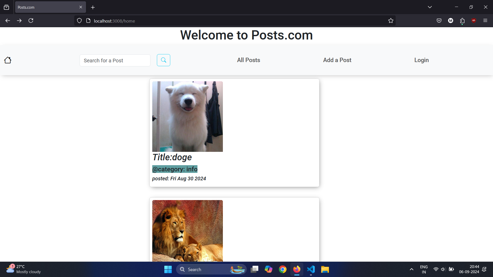
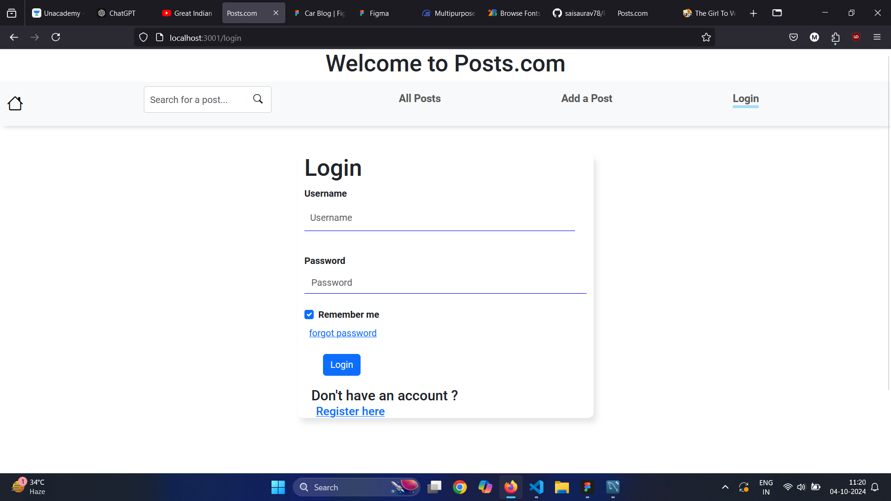
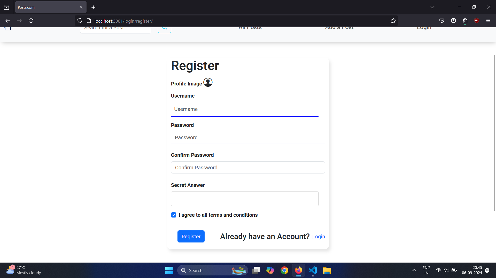
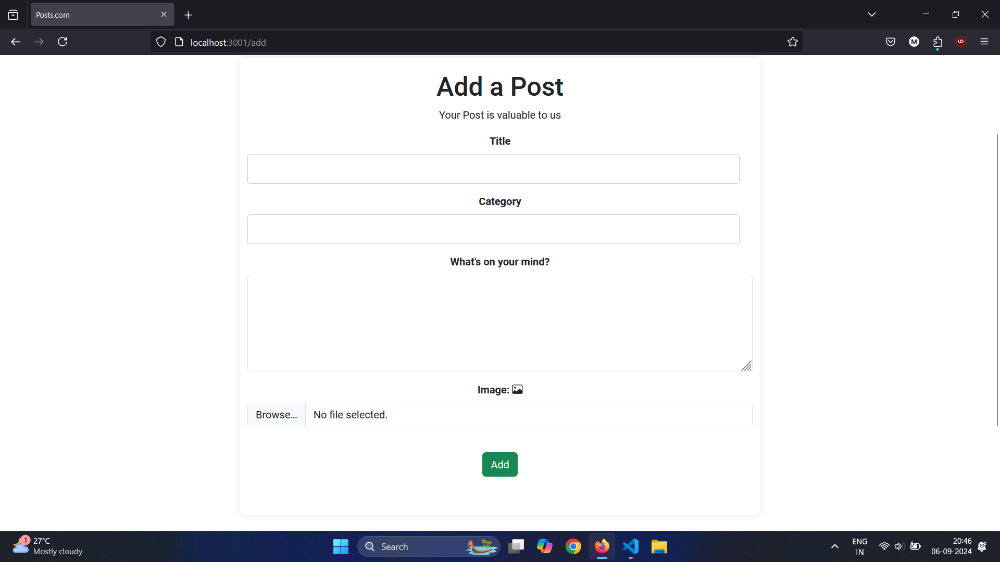
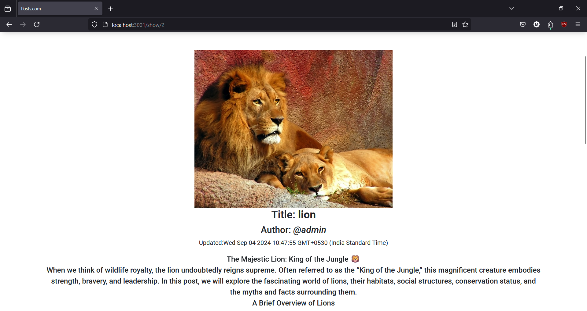
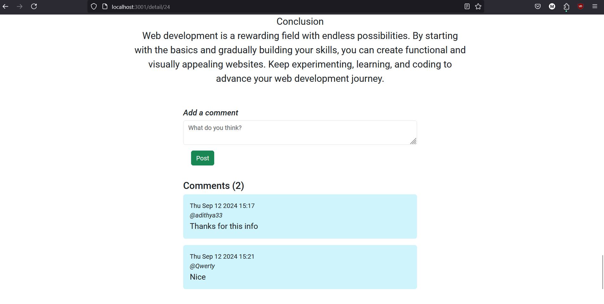

# Posts.com

Posts.com is a simple and user-friendly blog application where users can register, log in, and share their thoughts through posts. Users can create, edit, and delete their own posts as well as comment on others' posts.

## Screenshots

### Homepage


### Login


### Register


### Post Creation


### Post Detailed


### Comments



## Features

- **User Authentication**: Users can register and log in using their credentials.
- **Create Posts**: Logged-in users can create new blog posts.
- **Edit Posts**: Users can edit their own posts.
- **Delete Posts**: Users can delete their own posts.
- **Comment on Posts**: Users can comment on other users' posts.
- **Responsive Design**: The application is designed to be responsive, providing a seamless experience across various devices.

## Technologies Used

- **Frontend**: HTML, CSS, Bootstrap
- **Backend**: Node.js, Express.js
- **Database**: MySQL
- **Templating Engine**: EJS
- **Authentication**: JWT (JSON Web Tokens)
- **File Upload**: Multer

## Installation

1. Clone the repository:
    ```bash
    git clone https://github.com/your-username/Posts.com.git
    ```

2. Install the dependencies:
    ```bash
    cd Posts.com
    npm install
    ```

3. Set up environment variables:
    - Create a `.env` file in the root directory.
    - Add your MySQL database URL, JWT secret, and other necessary environment variables as shown below:
        ```bash
        DB_HOST
        DB_PORT
        DB_NAME
        DB_USER
        DB_PASS
        PORT=3001
        SECRET_KEY
        ```

4. Run the application:
    ```bash
    npm start
    ```

5. Visit `http://localhost:3001` in your browser to view the application.

## Usage

- Register for a new account or log in with existing credentials.
- Create a new blog post using the "Add a Post" button.
- Edit or delete your posts from the homepage.
- Comment on other user's posts by clicking on a post and adding your comment.

## Contributing

Contributions are welcome! Please feel free to submit a Pull Request.

